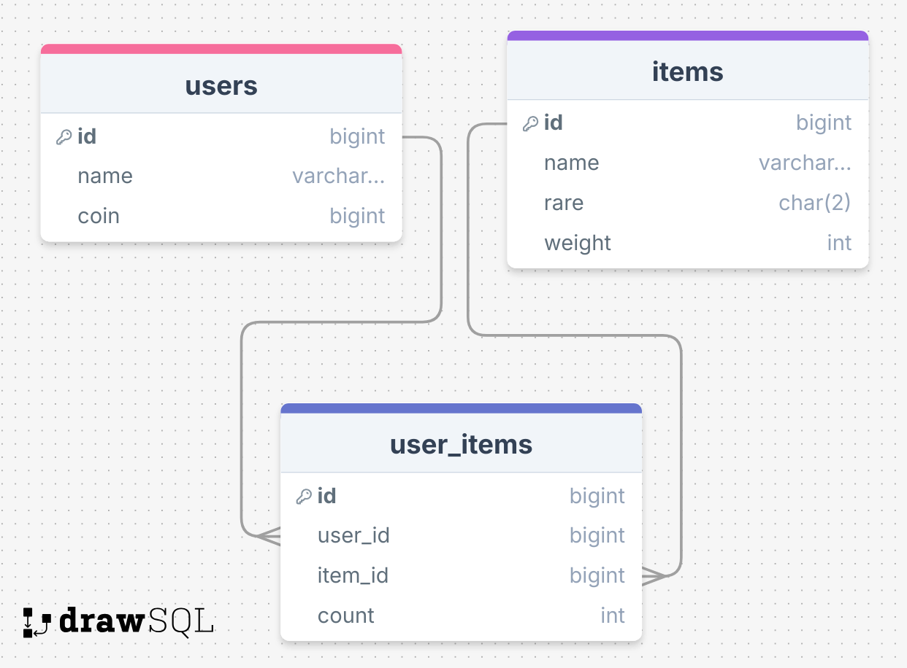

# go-mock-test-demo

## DB

### スキーマ



### setup

以下のコマンドでDBコンテナを起動します。

```
docker run --rm --name go-mock-test-db \
  -e MYSQL_ROOT_PASSWORD=password \
  -e MYSQL_DATABASE=app \
  -p 13306:3306 \
  -v $(pwd)/database:/docker-entrypoint-initdb.d \
  -d mysql:9.0
```

起動時に流すクエリ

```sql
CREATE TABLE `users`(
    `id` BIGINT UNSIGNED NOT NULL AUTO_INCREMENT PRIMARY KEY,
    `name` VARCHAR(50) NOT NULL,
    `coin` BIGINT NOT NULL
);
CREATE TABLE `user_items`(
    `id` BIGINT UNSIGNED NOT NULL AUTO_INCREMENT PRIMARY KEY,
    `user_id` BIGINT UNSIGNED NOT NULL,
    `item_id` BIGINT UNSIGNED NOT NULL,
    `count` INT NOT NULL
);
CREATE TABLE `items`(
    `id` BIGINT UNSIGNED NOT NULL AUTO_INCREMENT PRIMARY KEY,
    `name` VARCHAR(255) NOT NULL,
    `rare` CHAR(2) NOT NULL,
    `weight` INT NOT NULL
);
ALTER TABLE
    `user_items` ADD CONSTRAINT `user_items_item_id_foreign` FOREIGN KEY(`item_id`) REFERENCES `items`(`id`);
ALTER TABLE
    `user_items` ADD CONSTRAINT `user_items_user_id_foreign` FOREIGN KEY(`user_id`) REFERENCES `users`(`id`);

INSERT INTO users (`id`, `name`, `coin`)
VALUES(NULL, "user1", 100);

INSERT INTO items (`id`, `name`, `rare`, `weight`) VALUES 
(NULL, "item1", "N", 15),
(NULL, "item2", "N", 15),
(NULL, "item3", "N", 15),
(NULL, "item4", "N", 15),
(NULL, "item5", "N", 15),
(NULL, "item6", "R", 6),
(NULL, "item7", "R", 6),
(NULL, "item8", "R", 6),
(NULL, "item9", "R", 6),
(NULL, "item10", "SR", 1);
```

テーブルの確認

```
docker exec -it go-mock-test-db mysql -uroot -p -e 'show tables;' app
Enter password: 
+---------------+
| Tables_in_app |
+---------------+
| items         |
| user_items    |
| users         |
+---------------+
```

データの確認

```
docker exec -it go-mock-test-db mysql -uroot -p -e 'select * from users;' app
Enter password: 
+----+-------+------+
| id | name  | coin |
+----+-------+------+
|  1 | user1 |  100 |
+----+-------+------+
```

```
docker exec -it go-mock-test-db mysql -uroot -p -e 'select * from items;' app
Enter password: 
+----+--------+------+--------+
| id | name   | rare | weight |
+----+--------+------+--------+
|  1 | item1  | N    |     15 |
|  2 | item2  | N    |     15 |
|  3 | item3  | N    |     15 |
|  4 | item4  | N    |     15 |
|  5 | item5  | N    |     15 |
|  6 | item6  | R    |      6 |
|  7 | item7  | R    |      6 |
|  8 | item8  | R    |      6 |
|  9 | item9  | R    |      6 |
| 10 | item10 | SR   |      1 |
+----+--------+------+--------+
```

## example

```
go run cmd/gacha/main.go 1
{"itemName": item7, "rare": R}
```

## mock

[moq](https://github.com/matryer/moq)を使用。以下のコマンドでモックを作成する。

```
make generate
```

